# GPT Magazine Portrait Workflow

一套基于 Codex 生图能力和 GPT Image 效果基准的人物杂志写真资产化工作流：配置一次，之后把同一人物的多角度照片拖给 Codex，就按仓库内置风格资产生成杂志写真。

它不是通用 AI 生图工具，也不是前端项目。它的目标很具体：用户把一个人物的多角度参考图拖给 Codex，复用本仓库里的风格资产、提示词规则和任务模板，经由 Claude Code / Doubao-Seed-2.0-Pro 做图片理解和提示词队列整理，由 Codex 调度、最终生图和落盘，生成高质量杂志写真。

**仓库定位**：资产库 + 工作流文档 + Codex skill 草案 + 默认脚本。当前版本是 MVP，不是独立软件。

## 先看这三件事

### 1. 这是什么

把同一个人的 3-5 张多角度照片拖给 Codex，触发本仓库的 `gpt-magazine-portrait` 工作流，生成带杂志封面、写真、男刊、高奢、生活方式气质的人物图片。

### 2. 你需要什么

- Codex 具备可用生图能力。
- Claude Code 已通过 CC Switch，或等价方式接入 Doubao-Seed-2.0-Pro。
- 同一个人的 3-5 张多角度照片，建议包含正脸、45 度侧脸、侧脸或半身/全身照。

注意：仓库脚本只能检查文件、模板和任务队列格式，不能自动验证你的 Codex 是否真的能生图，也不能自动验证 Doubao 是否已接入。

### 3. 你不需要做什么

- 不需要重新收集风格图，仓库已带风格参考资产。
- 不需要手动填写人物名、目录、路径、生成张数或“是否开始”。
- 不使用浏览器自动化、ChatGPT 网页版或 GPT 桌面端。
- 不使用 DeepSeek V4 Pro。

## 快速开始
本项目按“配置一次，之后拖图即跑”设计。普通用户不需要自己填写路径、人物名或任务参数。

如果你只想验证仓库脚本能不能跑，不消耗生图额度，先看 [无生图快速测试](docs/QUICKSTART_TEST.md)。

### 配置一次

```powershell
git clone https://github.com/Oiawlm/gpt-magazine-portrait-workflow.git
cd gpt-magazine-portrait-workflow
powershell -ExecutionPolicy Bypass -File .\skills\gpt-magazine-portrait\scripts\check_workflow_prereqs.ps1
```

这个命令只代表“仓库文件和模板正常”，不代表 Codex 生图能力或 Doubao 接入已经可用。

### 日常使用

把同一个人物的多角度照片拖给 Codex，然后发一句：

```text
按 gpt-magazine-portrait 工作流处理这些照片。
```

Codex 会从本轮拖入的图片附件中读取本地路径，并自动传给 `start_character_run.ps1`。普通用户不需要把图片放进仓库目录，也不需要手动填写路径。

如果当前 Codex 环境完全不能读取拖入图片的本地路径，流程会停在“读取用户拖入图片”阶段。这不是用户操作错误，而是当前 Codex 环境没有暴露附件路径；此时应由 agent 或维护者处理环境问题，不应把“手动放入某个文件夹”写成公开主流程。

Codex 默认执行：

1. 自动创建人物运行目录。
2. 读取并保存用户拖入的原始照片。
3. 用 Codex 生图能力生成多视图参考图。
4. 让 Claude Code + Doubao-Seed-2.0-Pro 读取多视图和风格库，生成第一轮 4 个任务。
5. 校验任务队列。
6. 由 Codex 自动生成最终杂志写真并保存。
7. 更新人物资料、任务状态和运行 manifest。

触发语和图片本身视为本轮执行授权；MVP 默认不再二次询问人物名、目录、张数或是否开始。只有缺少关键前置条件，或即将覆盖已有输出文件时，Codex 才停下来说明问题。

如果 Codex 当前没有生图能力，流程会停在“生成多视图参考图”。如果 Claude Code / Doubao-Seed-2.0-Pro 不可用，流程会停在“生成提示词队列”。这两种情况不是脚本错误，而是外部能力未配置。

## 你能用它做什么

- 固定一个人物形象，生成多种杂志封面、写真、男刊、高奢、生活方式风格图片。
- 直接使用仓库自带的风格参考库，不用重新收集海报和参考图。
- 把每次生图任务沉淀成任务队列、人物资料、运行记录和可复用提示词规则。
- 配合 `skills/gpt-magazine-portrait/`，逐步把流程变成 Codex 可执行的自动化工作流。

## 项目结构

```text
assets/
  style-reference/        风格参考库、聚类结果、style pack
  characters/             良子、嘎子人物资料、参考图、生成样张
  source-notes/           早期提示词和对话记录
  source-images/          根目录补充图片素材
docs/
  WORKFLOW.md             完整工作流
  STANDARD.md             目录、命名、任务、反馈规范
  PROMPT_RULES.md         提示词规则
  GPT_IMAGE_GUIDE.md      Codex 生图执行说明
  AGENT_ROLES.md          Codex / Claude Code / Doubao 分工
skills/
  gpt-magazine-portrait/  Codex skill 草案和脚本
templates/                人物资料、风格包、任务队列模板
workflow-runs/            已跑过的任务队列和风格谱系
output-records/           试跑记录、复盘和交接记录
```

注意：`assets/characters/*/generation_tasks.json` 是早期人物风格记录，用来展示已有风格探索历史；它不是 `validate_queue.ps1` 的标准任务队列输入。标准任务队列请参考 `templates/generation_task.template.json` 和 `workflow-runs/*/*prompt_queue.json`。

## 工具分工

| 工具 | 负责什么 |
|---|---|
| Codex | 主控流程、创建默认目录、审核任务、最终生图、保存文件、记录结果 |
| Claude Code + Doubao-Seed-2.0-Pro | 读人物图、读风格图、提取风格、生成提示词队列 |
| 用户 | 提供人物参考图；后续可选给审美反馈 |

## v0.1.0-mvp 版本重要说明
当前为首个开源MVP版本，有以下客观限制，请知晓：
1. **Codex 生图依赖**：标准路线要求 Codex 具备可用的生图能力，用于生成多视图参考图和最终杂志写真。
2. **Doubao 依赖**：自动生成任务队列需要 Claude Code 已配置 CC Switch，或通过等价方式接入 Doubao-Seed-2.0-Pro。
3. **DeepSeek 边界**：当前工作流不使用 DeepSeek V4 Pro；不要把它作为任务队列、文本整理、fallback 或可选步骤写入本项目流程。
4. **禁止 UI 自动化路线**：本项目不使用控制浏览器、操作 ChatGPT 网页版或 GPT 桌面端作为工作流、fallback 或未来规划。
5. **效果基准**：本工作流的提示词和风格优化以 GPT Image 效果为基准，使用其他生图模型效果不做保证。

默认目录结构：

```text
assets/characters/<auto-character-id>/
  reference/
    originals/    → 用户拖入的原始照片
    multiview/    → Codex 生成的多视图参考图
  generated/      → 最终杂志写真
  tasks/          → Doubao 生成的任务队列
  runs/           → 本轮运行 manifest
  <auto-character-id>.md
```

### 多视图参考图
**这步是人物不崩的核心，由 Codex 生图能力生成：**
1. 读取提示词：`templates/multiview_reference_prompt.template.md`
2. 使用你准备的多角度人物照片作为参考
3. 生成包含"正面+左侧面+右侧面+三分之四侧脸"的多视图参考图
4. 保存到 `assets/characters/<auto-character-id>/reference/multiview/` 目录

⚠️ 重要提示：Doubao-Seed 只负责读图，不负责生成这张图！

### 任务队列
Claude Code 会通过 Doubao-Seed-2.0-Pro 自动：
- 调用 Doubao-Seed-2.0-Pro 读图
- 结合风格库生成提示词
- 输出第一轮 4 个任务到 `assets/characters/<auto-character-id>/tasks/`
- 自动运行校验脚本验证格式

### 自动生图
队列校验通过后，Codex 按任务队列逐张生成图片，并把结果保存到 `generated/` 目录。本项目不使用控制浏览器、操作 ChatGPT 网页版或 GPT 桌面端作为执行路线。

### 记录结果
生成完成后：
1. 将图片保存到任务指定目录。
2. 更新任务状态和人物资料。
3. 必要时把执行结果写入 `output-records/`。

---

## 完整详细流程
如果需要更多控制，可以按下面的完整流程操作：

<details>
<summary>点击展开完整流程</summary>

### 完整流程1：准备阶段
- 1.1 克隆仓库到本地
- 1.2 运行 `check_workflow_prereqs.ps1`
- 1.3 用户把同一人物多角度照片拖给 Codex
- 1.4 Codex 调用 `start_character_run.ps1` 创建默认运行目录并复制原图

### 完整流程2：多视图生成
- 2.1 使用多视图提示词模板
- 2.2 通过 Codex 生图能力生成标准化多视图参考图
- 2.3 保存到 `reference/multiview/` 作为核心参考

### 完整流程3：人物资料完善
- 3.1 Codex 根据用户原图和多视图自动草拟人物资料
- 3.2 记录可观察到的面部特征和体型
- 3.3 明确气质定位和适合风格
- 3.4 列出不可改变的核心特征

### 完整流程4：任务队列生成
- 4.1 选择适合的风格包
- 4.2 调用 Doubao-Seed 读取人物图和风格图
- 4.3 生成结构化任务队列JSON
- 4.4 运行校验脚本验证格式正确性

### 完整流程5：自动执行前检查
- 5.1 检查任务 JSON 是否通过校验
- 5.2 检查人物参考图和风格参考图是否存在
- 5.3 检查输出文件是否会覆盖旧文件
- 5.4 若不会覆盖且前置条件完整，直接进入 Codex 生图

### 完整流程6：Codex 生图执行
- 6.1 Codex 按任务队列逐条生成图片
- 6.2 每生成一张立即保存到指定路径
- 6.3 验证文件完整性和可访问性
- 6.4 实时更新任务状态

### 完整流程7：记录结果
- 7.1 更新人物 Markdown，添加生成图片路径
- 7.2 更新任务队列的最终状态
- 7.3 记录执行结果到 output-records

</details>

## Codex Skill 用法

本仓库包含一个 skill 草案：

```text
skills/gpt-magazine-portrait/
```

它现在提供：

- `SKILL.md`：Codex 执行这套工作流时的说明
- `scripts/check_workflow_prereqs.ps1`：检查仓库前置条件
- `scripts/start_character_run.ps1`：按默认目录启动新人物运行并复制拖入图片
- `scripts/make_character_dirs.ps1`：创建新人物目录
- `scripts/validate_queue.ps1`：校验任务队列 JSON

当前仓库内的 skill 是流程说明和脚本集合。MVP 阶段可以直接让 Codex/Claude Code 阅读 `skills/gpt-magazine-portrait/SKILL.md` 执行；如果要安装成 Codex 本地 skill，可在后续把 `skills/gpt-magazine-portrait/` 复制到 Codex skills 目录。

## 无生图测试

如果你只是想确认仓库脚本和模板能运行，不需要准备人物照片，也不需要消耗生图额度。见 [docs/QUICKSTART_TEST.md](docs/QUICKSTART_TEST.md)。

## 效果展示

### 完整流程对比（三列直观展示）
**流程：用户原始照片 → AI生成标准化多视图参考图 → 最终杂志写真**
| 用户原始参考照片 | AI生成多视图参考图（锁定人物一致性） | 最终生成效果 |
|------------------|----------------------------------------|--------------|
|  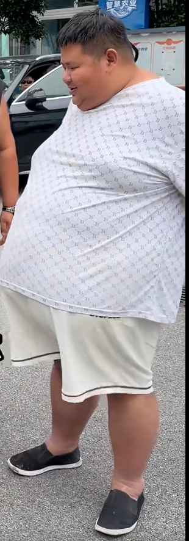 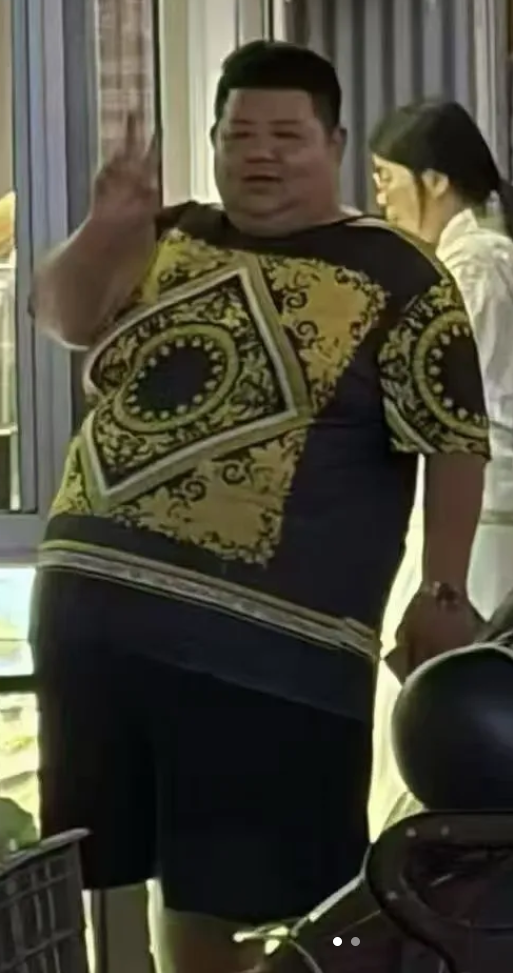 | 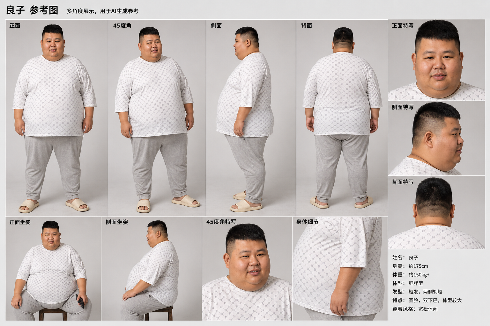 |  <br> 港口硬朗西装风 |
| 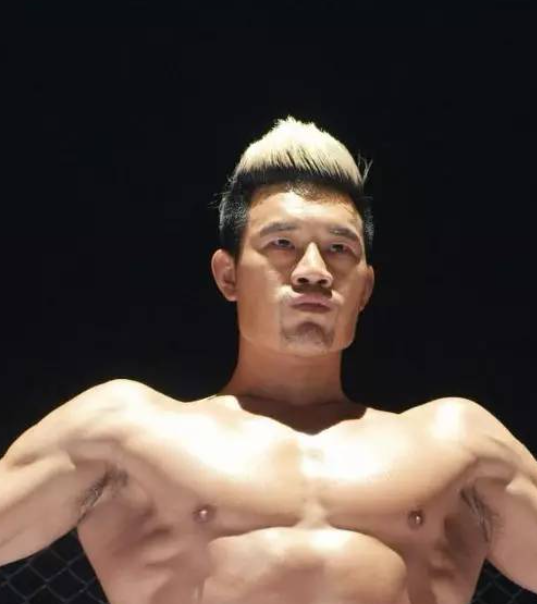 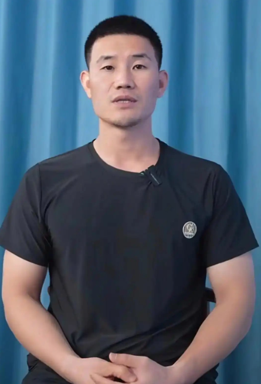 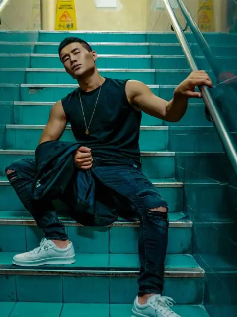 | 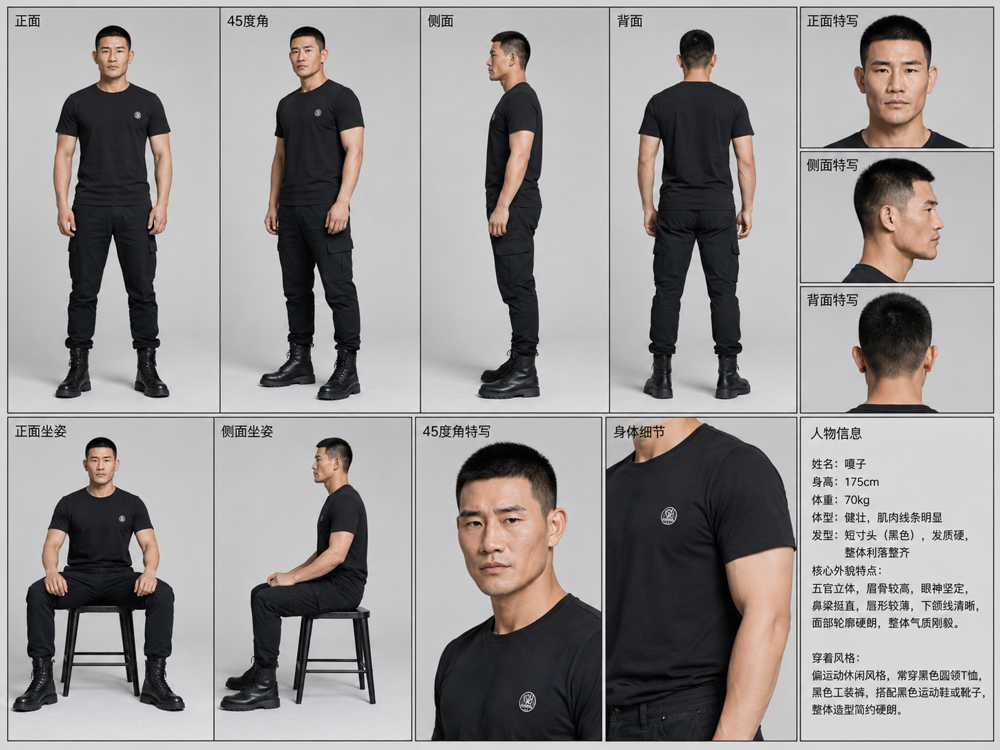 |  <br> 红绳镜面西装封面 |

### 更多风格效果
#### 良子其他风格
| 未来都市机能风 | 新中式武侠风 | 海岛轻奢度假风 |
|----------------|--------------|----------------|
| 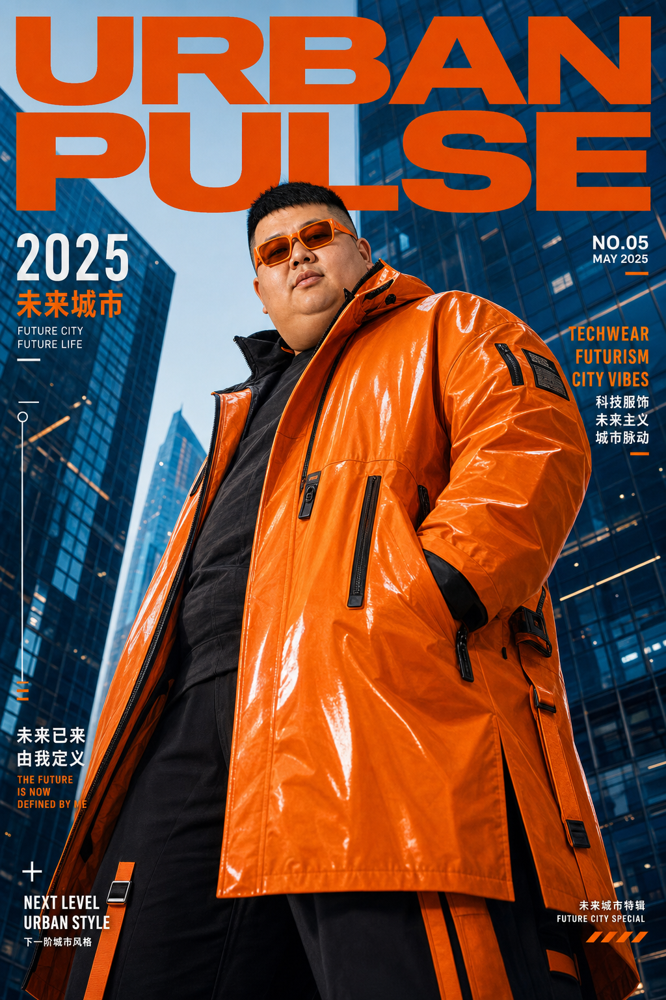 | 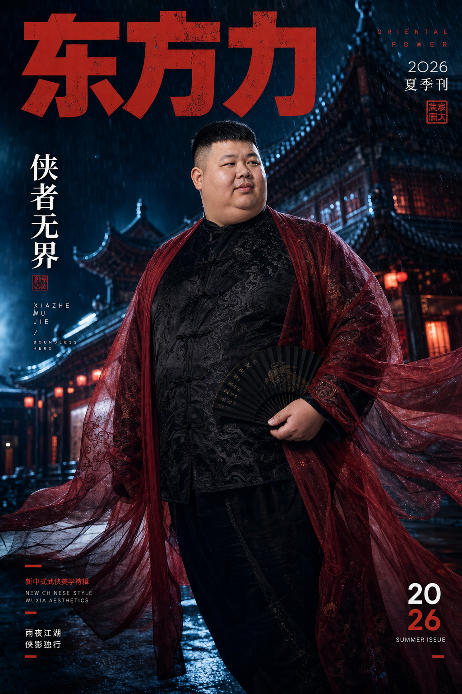 |  |

#### 嘎子其他风格
| 极简近景肖像封面 | 报纸纪实侧颜封面 | 男士杂志海报 |
|----------------|--------------|----------------|
|  | 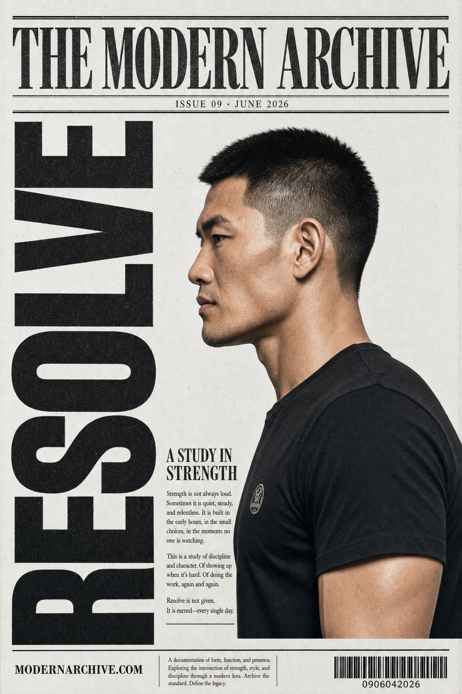 | 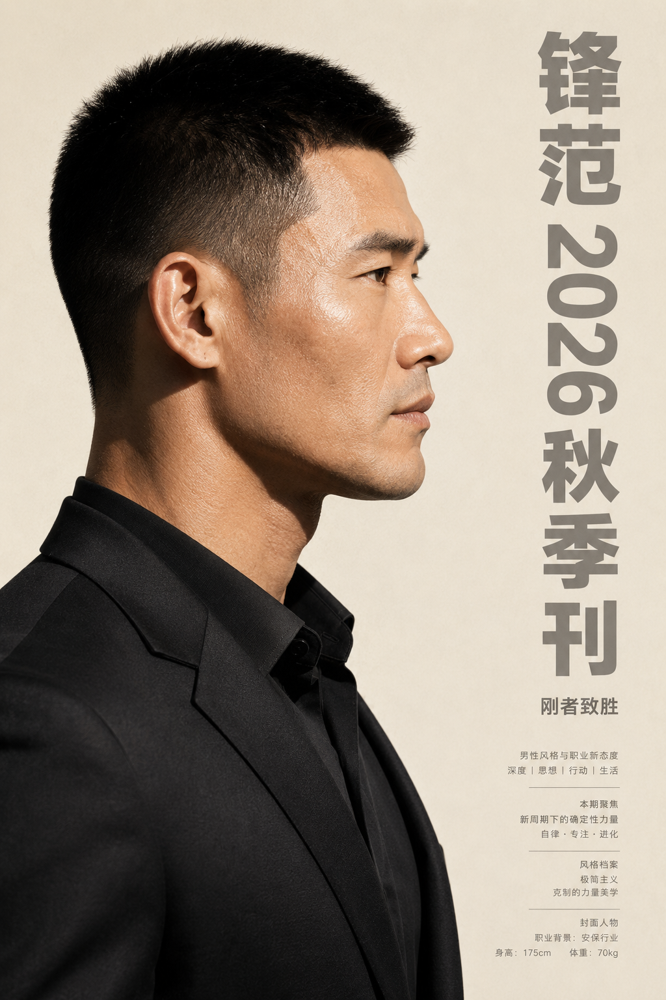 |

更多效果见 [assets/SHOWCASE.md](assets/SHOWCASE.md)。

## 常见问题

### 为什么强调 Codex 生图能力？

这套风格资产和提示词经验以 GPT Image 效果为基准，但本项目的标准执行路线是由 Codex 直接完成多视图参考图和最终图片生成，不使用 ChatGPT 网页版或桌面端操作。

### DeepSeek V4 Pro 在这个流程里用不用？

不用。当前标准工作流只使用 Codex、Claude Code 和 Doubao-Seed-2.0-Pro；DeepSeek V4 Pro 不进入本项目执行路线。

### 第一轮应该生成多少张？

建议 3 到 5 张。先验证人物一致性和风格方向，不要一上来批量铺太多。

### 文字总是漂移怎么办？

减少小字要求，明确最大主视觉文字；必要时让 Codex 基于同一任务做定向修正，不要无限重跑。

## 贡献

欢迎提交 Issue 和 PR。贡献前请阅读 [CONTRIBUTING.md](CONTRIBUTING.md)。

## 贡献者
- [Oiawlm](https://github.com/Oiawlm) - 项目发起与核心开发，流程设计、风格资产整理、经验沉淀

## 许可证

本项目采用 MIT 许可证，详见 [LICENSE](LICENSE)。
