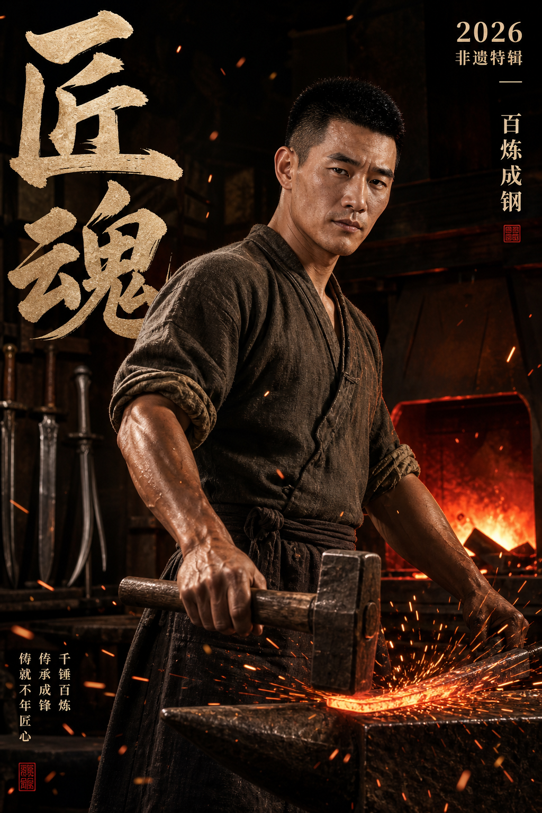
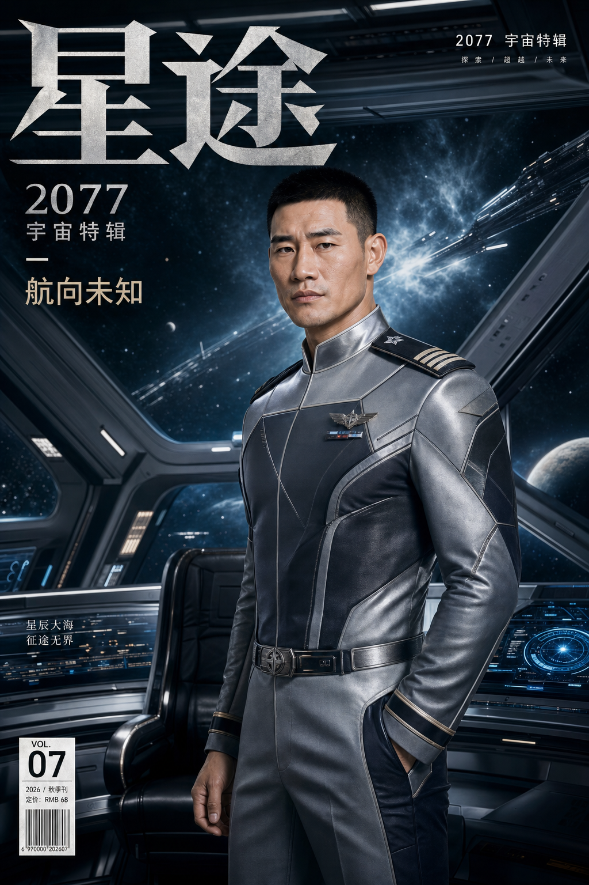

# AI Magazine Portrait Workflow

一套基于 GPT Image 的人物杂志写真资产化工作流。

它不是通用 AI 生图工具，也不是前端项目。它的目标很具体：用户准备一个人物的多角度参考图，复用本仓库里的风格资产、提示词规则和任务模板，经由 Claude Code / Doubao-Seed-2.0-Pro 做图片理解和提示词整理，由 Codex 调度、确认、落盘，最终用 GPT Image / ChatGPT Plus 生成高质量杂志写真。

## 你能用它做什么

- 固定一个人物形象，生成多种杂志封面、写真、男刊、高奢、生活方式风格图片。
- 直接使用仓库自带的风格参考库，不用重新收集海报和参考图。
- 把每次生图任务沉淀成任务队列、人物资料、运行记录和可复用提示词规则。
- 配合 `skills/gpt-magazine-portrait/`，逐步把流程变成 Codex 可执行的自动化工作流。

## 项目结构

```text
assets/
  style-reference/        风格参考库、聚类结果、style pack
  characters/             良子、嘎子人物资料、参考图、生成样张
  source-notes/           早期提示词和对话记录
  source-images/          根目录补充图片素材
docs/
  WORKFLOW.md             完整工作流
  STANDARD.md             目录、命名、任务、反馈规范
  PROMPT_RULES.md         提示词规则
  GPT_IMAGE_GUIDE.md      GPT Image 执行说明
  AGENT_ROLES.md          Codex / Claude Code / Doubao / DeepSeek 分工
skills/
  gpt-magazine-portrait/  Codex skill 草案和脚本
templates/                人物资料、风格包、任务队列模板
workflow-runs/            已跑过的任务队列和风格谱系
output-records/           试跑记录、复盘和交接记录
```

## 工具分工

| 工具 | 负责什么 |
|---|---|
| GPT Image / ChatGPT Plus | 最终生图 |
| Claude Code + Doubao-Seed-2.0-Pro | 读人物图、读风格图、提取风格、生成提示词队列 |
| DeepSeek V4 Pro | 只做文本整理和文档总结，不能读图 |
| Codex | 调度流程、审核任务、保存文件、更新记录、维护仓库 |
| 用户 | 提供人物参考图、确认是否生图、做审美反馈 |

## 🔴 v1.0.0 MVP 版本重要说明
当前为首个开源MVP版本，有以下客观限制，请知晓：
1. **生图环节需手动操作**：多视图参考图和最终生图需要您手动在ChatGPT Plus/GPT Image中操作，目前GPT Image无公开API可实现完全自动化
2. **Doubao依赖**：自动生成任务队列需要Claude Code已配置CC Switch可切换到Doubao-Seed-2.0-Pro；无Doubao时可按照文档手动生成任务队列
3. **少量人工干预**：需要您手动上传人物照片、填写人物资料、选择风格包、确认生图，全流程约需要4-5次人工操作
4. **效果依赖GPT Image**：本工作流的提示词和风格优化均针对GPT Image/ChatGPT Plus，使用其他生图模型效果不做保证

## 🚀 5分钟快速开始
只需要7步，从0到1生成你的第一组杂志写真：

| 步骤 | 操作 | 耗时 | 负责方 |
|------|------|------|--------|
| 1 | 准备人物照片 | 5分钟 | 用户 |
| 2 | 创建人物目录 | 1分钟 | Codex/Claude |
| 3 | 生成多视图参考图 | 5分钟 | GPT Image |
| 4 | 填写人物资料 | 3分钟 | 用户 |
| 5 | 生成任务队列 | 2分钟 | Doubao-Seed |
| 6 | 确认并生图 | 10分钟 | GPT Image |
| 7 | 保存并记录结果 | 2分钟 | Codex/Claude |

---

### 1. 准备人物照片
准备至少3张多角度照片：
- ✅ 正脸清晰照
- ✅ 45°侧脸照  
- ✅ 正侧脸照
- 📌 提示：光线均匀、无遮挡的照片效果最好

### 2. 克隆仓库并创建人物目录
```powershell
# 克隆仓库
git clone https://github.com/Oiawlm/ai-magazine-portrait-workflow.git
cd ai-magazine-portrait-workflow

# 创建人物目录（将 xiaoming 替换为你的人物名）
powershell -ExecutionPolicy Bypass -File .\skills\gpt-magazine-portrait\scripts\make_character_dirs.ps1 -CharacterName "xiaoming"
```
自动生成目录结构：
```text
assets/characters/xiaoming/
  reference/      → 放入你准备的人物照片
  generated/      → 最终生成的图片存在这里
  tasks/          → 自动生成的任务队列存在这里
  xiaoming.md     → 人物资料模板，填写人物信息
```

### 3. （关键）生成多视图参考图
**这步是人物不崩的核心！必须用 GPT Image 生成：**
1. 打开 GPT Image / ChatGPT Plus
2. 复制提示词：`templates/multiview_reference_prompt.template.md`
3. 上传你准备的3张人物照片
4. 生成包含"正面+左侧面+右侧面+三分之四侧脸"的多视图参考图
5. 保存到 `assets/characters/xiaoming/reference/` 目录

⚠️ 重要提示：Doubao-Seed 只负责读图，不负责生成这张图！

### 4. 填写人物资料
编辑 `assets/characters/xiaoming/xiaoming.md`，重点写：
- 基本信息：年龄、性别、体型
- 面部特征：脸型、五官、发型、标志性特征（如痣、疤痕）
- 气质定位：适合的风格和场景
- **不可改变项**：比如"必须保留右脸的痣""不要改变发型""不要瘦身"

### 5. 生成任务队列
把这段复制给 Claude Code，自动生成任务队列：
```text
按 gpt-magazine-portrait 工作流处理：
人物名：xiaoming
多视图参考图已放在 assets/characters/xiaoming/reference/
人物资料已写在 assets/characters/xiaoming/xiaoming.md
生成第一轮3-5个杂志写真任务队列
```
Claude Code 会自动：
- 调用 Doubao-Seed-2.0-Pro 读图
- 结合风格库生成提示词
- 输出任务队列到 `assets/characters/xiaoming/tasks/`
- 自动运行校验脚本验证格式

### 6. 确认并生图
生图前会自动给你确认：
- 📋 本轮要生成几张
- 🎨 每个任务的风格
- 📂 输出路径
- 💰 预计消耗额度

你确认后，Codex 会自动调用 GPT Image 批量生成，生成的图片自动保存到 `generated/` 目录。

### 7. 记录与优化
生成完成后：
1. 评价每张图的效果（像不像？好不好看？）
2. 系统自动记录反馈，优化后续提示词
3. 满意的图可以作为样例，不满意的可以调整后重新生成

---

## 完整详细流程
如果需要更多控制，可以按下面的完整流程操作：

<details>
<summary>点击展开完整流程</summary>

### 完整流程1：准备阶段
- 1.1 克隆仓库到本地
- 1.2 收集人物多角度参考图（至少3张）
- 1.3 运行脚本创建人物目录结构
- 1.4 将参考图放入 reference 目录

### 完整流程2：多视图生成
- 2.1 使用多视图提示词模板
- 2.2 通过 GPT Image 生成标准化多视图参考图
- 2.3 保存到 reference 目录作为核心参考

### 完整流程3：人物资料完善
- 3.1 填写人物基本信息
- 3.2 详细描述面部特征和体型
- 3.3 明确气质定位和适合风格
- 3.4 列出不可改变的核心特征

### 完整流程4：任务队列生成
- 4.1 选择适合的风格包
- 4.2 调用 Doubao-Seed 读取人物图和风格图
- 4.3 生成结构化任务队列JSON
- 4.4 运行校验脚本验证格式正确性

### 完整流程5：生图前确认
- 5.1 列出所有任务详情（ID、风格、输出路径）
- 5.2 确认是否覆盖已有文件
- 5.3 用户确认后才允许执行生图

### 完整流程6：GPT Image 执行
- 6.1 逐条提交任务到 GPT Image
- 6.2 每生成一张立即保存到指定路径
- 6.3 验证文件完整性和可访问性
- 6.4 实时更新任务状态

### 完整流程7：记录与迭代
- 7.1 更新人物 Markdown，添加生成图片和评价
- 7.2 更新任务队列的最终状态
- 7.3 记录用户反馈到 output-records
- 7.4 沉淀有效规则到 PROMPT_RULES.md
- 7.5 生成下一轮优化建议

</details>

## Codex Skill 用法

本仓库包含一个 skill 草案：

```text
skills/gpt-magazine-portrait/
```

它现在提供：

- `SKILL.md`：Codex 执行这套工作流时的说明
- `scripts/make_character_dirs.ps1`：创建新人物目录
- `scripts/validate_queue.ps1`：校验任务队列 JSON

之后可以把这个 skill 安装到 Codex skills 目录，让 Codex 在用户说“按 gpt-magazine-portrait 工作流跑这个人”时自动触发。

## 效果展示

### 完整流程对比（三列直观展示）
**流程：用户原始照片 → AI生成标准化多视图参考图 → 最终杂志写真**
| 用户原始参考照片 | AI生成多视图参考图（锁定人物一致性） | 最终生成效果 |
|------------------|----------------------------------------|--------------|
|    |  |  <br> 港口硬朗西装风 |
|    |  |  <br> 红绳镜面西装封面 |

### 更多风格效果
#### 良子其他风格
| 未来都市机能风 | 新中式武侠风 | 海岛轻奢度假风 |
|----------------|--------------|----------------|
|  |  |  |

#### 嘎子其他风格
| 精英商务律师风 | 传统铸剑匠人风 | 星际舰队舰长风 |
|----------------|--------------|----------------|
|  |  |  |

更多效果见 [assets/SHOWCASE.md](assets/SHOWCASE.md)。

## 常见问题

### 为什么最终生图推荐 GPT Image？

这套风格资产和提示词经验是围绕 GPT Image / ChatGPT Plus 试出来的。其他模型可以参考流程，但不保证同样效果。

### DeepSeek V4 Pro 能不能读图？

不能。它只适合文本整理、规则总结、文档改写，不负责图像理解。

### 第一轮应该生成多少张？

建议 3 到 5 张。先验证人物一致性和风格方向，不要一上来批量铺太多。

### 文字总是漂移怎么办？

减少小字要求，明确最大主视觉文字；如果画面很好但文字错了，优先在同一 GPT Image 对话里定向编辑。

## 贡献

欢迎提交 Issue 和 PR。贡献前请阅读 [CONTRIBUTING.md](CONTRIBUTING.md)。

## 贡献者
- [Oiawlm](https://github.com/Oiawlm) - 项目发起与核心开发，流程设计、风格资产整理、经验沉淀

## 许可证

本项目采用 MIT 许可证，详见 [LICENSE](LICENSE)。
