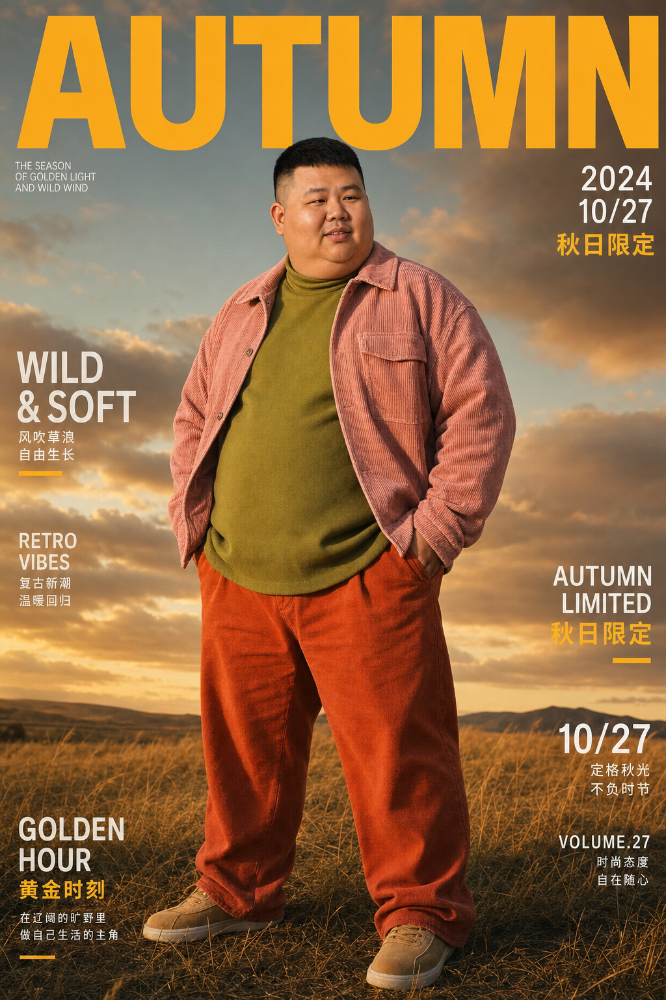

# AI Magazine Portrait Workflow

一套用于生成高质量人物杂志写真图的资产化工作流。

这个仓库不是通用 AI 生图工具，也不是前端集成项目。它沉淀的是一套已经试跑过的流程：准备人物多角度照片，使用现成风格资产库和提示词规范，经由 Claude Code / Doubao-Seed-2.0-Pro 做风格理解与提示词整理，由 Codex 调度、记录和落盘，最终使用 GPT Image / ChatGPT Plus 生成图片。

## 适合谁

- 想固定一个人物形象，并批量生成不同杂志写真风格的人。
- 想直接使用已有风格资产库，不想从零收集海报参考的人。
- 想用 GPT Image 做最终出图，同时保留一套可复盘、可迭代的本地流程的人。

## 核心流程

1. 准备人物正脸、侧脸、背面或多角度参考图。
2. 使用现有 `assets/style-reference/` 风格参考库。
3. 让 Doubao-Seed-2.0-Pro 读取人物图和风格图，整理风格包。
4. 生成结构化任务队列。
5. Codex 审核任务队列，确认输出路径和是否覆盖。
6. 使用 GPT Image / ChatGPT Plus 执行生图。
7. 图片保存到人物资料库，并同步更新人物 Markdown。
8. 用户评价结果，把审美反馈写回提示词规则。

## 目录

- `assets/`：风格参考图、人物参考图、生成样张、原始对话和素材。
- `docs/`：工作流、规范、Agent 分工和 GPT Image 执行说明。
- `templates/`：任务包、人物资料、风格包模板。
- `workflow-runs/`：已跑过的任务队列、风格谱系和结构化运行记录。
- `output-records/`：跨项目复盘和执行记录。
- `examples/`：如何接入新人物的示例说明。

## 推荐工具栈

- 最终生图：GPT Image / ChatGPT Plus。
- 图片理解和风格提示词：Claude Code + Doubao-Seed-2.0-Pro。
- 文本整理：DeepSeek V4 Pro，注意它不能读图。
- 调度和落盘：Codex。

其他模型可以参考本流程，但最终效果默认以 GPT Image 为基准。

## 自动化方向

这个仓库未来可以配套一个 Codex skill。仓库保存资产和规范，skill 负责让 Codex 在用户上传新人物多角度照片后，自动创建人物目录、准备提示词队列、等待用户确认、调用 GPT Image 生图、保存结果并更新记录。

详见 [docs/AUTOMATION_SKILL_DESIGN.md](docs/AUTOMATION_SKILL_DESIGN.md)。

## 快速开始

1. 把新人物多角度参考图放入 `assets/characters/<name>/reference/`。
2. 按 `templates/character_profile.template.md` 写人物核心设定。
3. 从 `assets/style-reference/` 选择风格包或重新聚类。
4. 用 `templates/generation_task.template.json` 组织生图任务。
5. 生图前人工确认任务数量、输出路径、是否覆盖旧图。
6. 执行生图后更新人物 Markdown 和运行记录。

详细步骤见 [docs/WORKFLOW.md](docs/WORKFLOW.md)。
## 效果展示
| 参考图 | 生成效果图 | 风格 |
|--------|------------|------|
|  |  | 秋日休闲复古风 |
|  |  | 杂志封面风 |
更多效果见 [assets/SHOWCASE.md](assets/SHOWCASE.md)。
## 许可证
本项目采用 MIT 许可证，详见 [LICENSE](LICENSE) 文件。
## 贡献
欢迎提交 Issue 和 PR！贡献前请阅读 [CONTRIBUTING.md](CONTRIBUTING.md)。
## 常见问题
### Q: 为什么只能用 GPT Image？
A: 本工作流的提示词和风格是针对 GPT Image 优化的，其他模型可能无法达到相同效果。你可以尝试适配其他模型，但效果不做保证。
### Q: 需要多少张参考图？
A: 至少需要正脸、45° 侧脸、正侧脸各一张，越多角度效果越好。参考图分辨率建议 ≥1024x1024，光线均匀，无强阴影。
### Q: 生图质量不好怎么办？
A: 首先检查提示词是否准确描述了人物特征和风格，然后尝试调整负面提示词排除不需要的元素。如果是 GPT Image 的文字漂移问题，可以尝试定向编辑。
