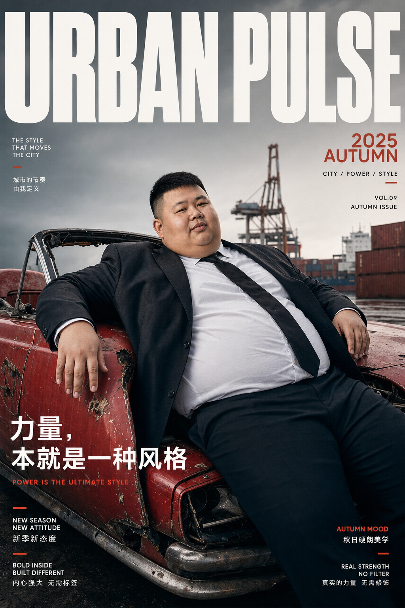
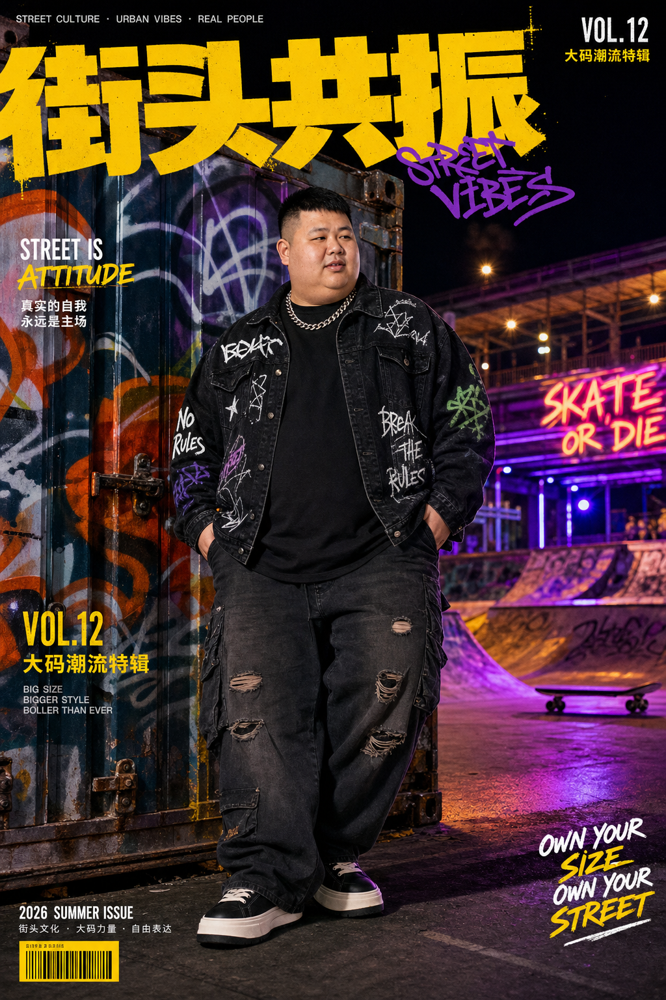
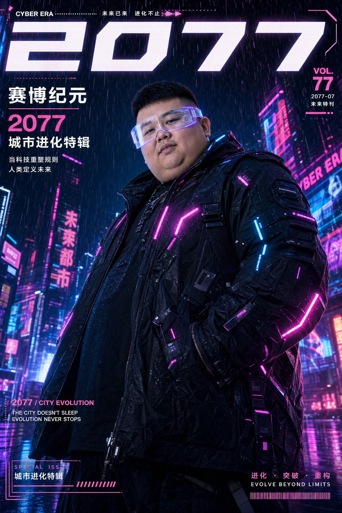
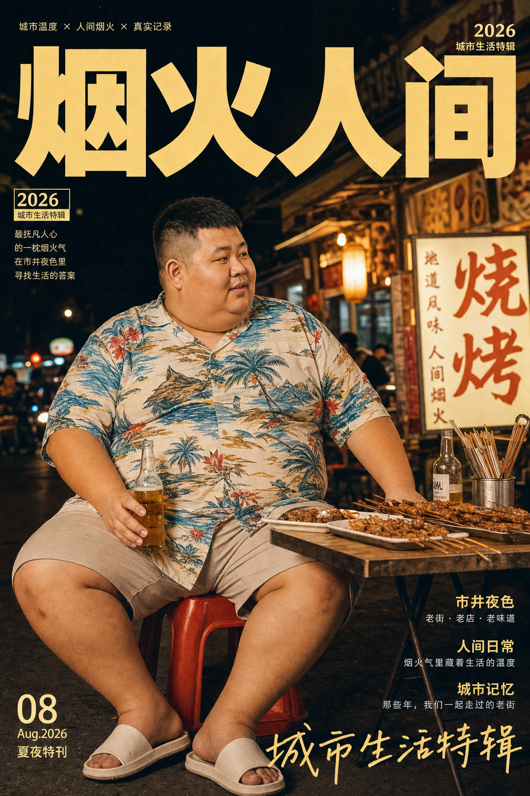
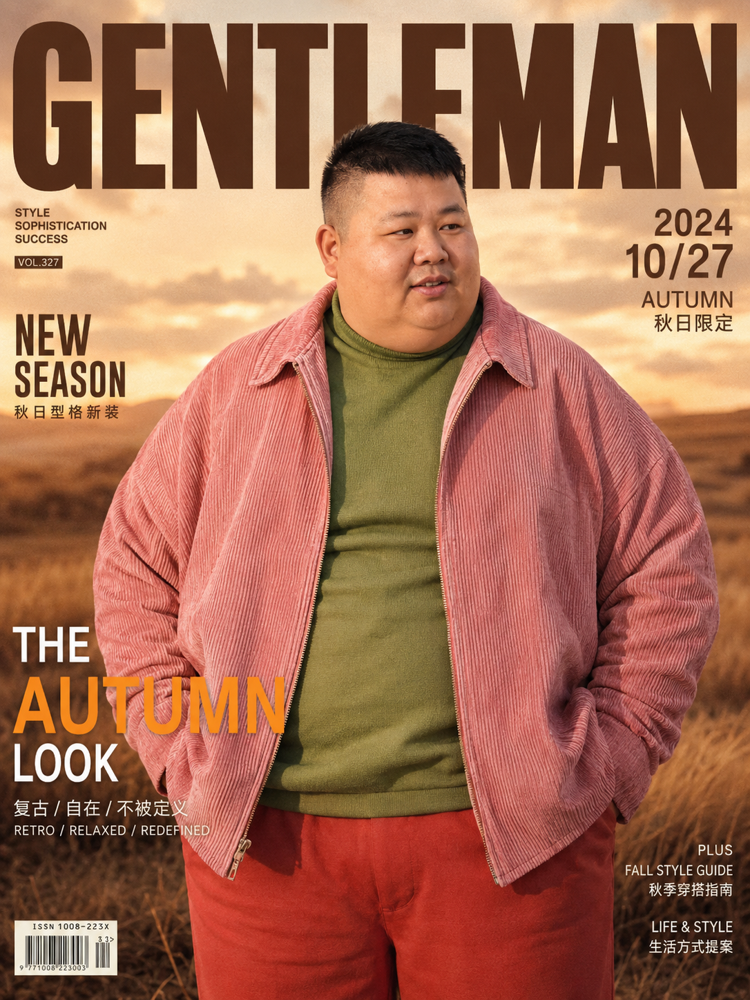
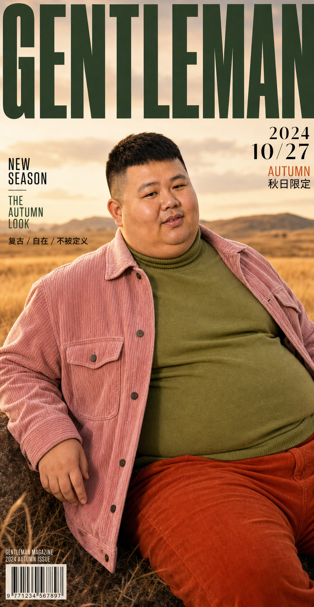
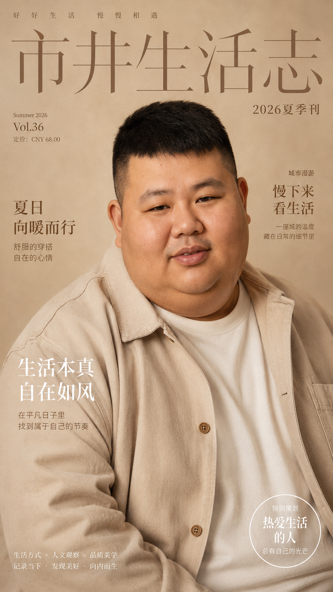
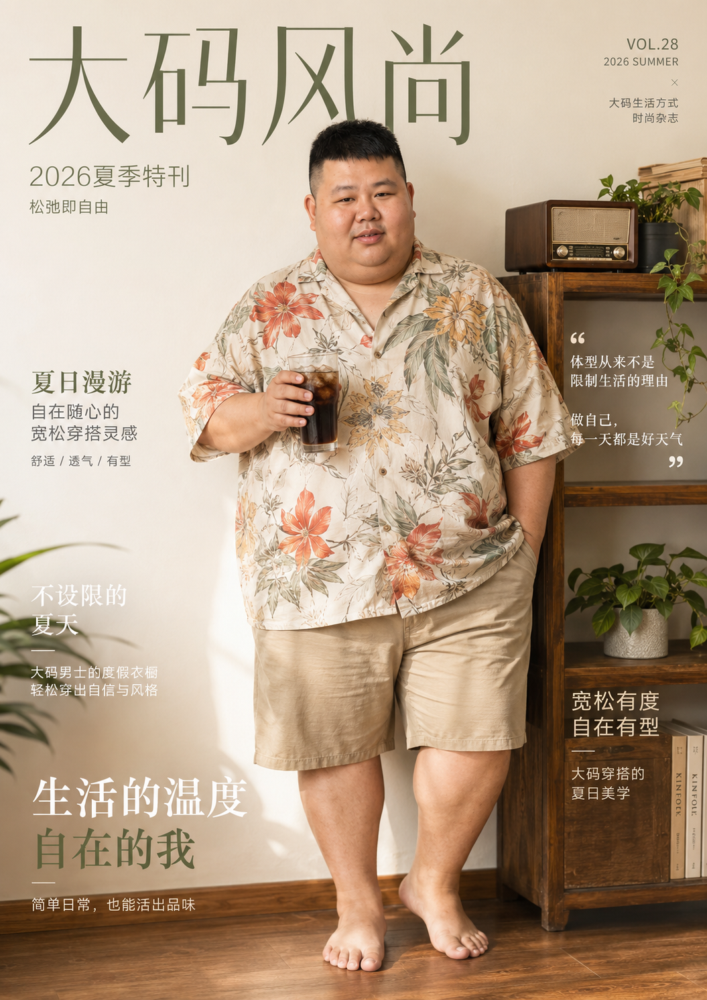
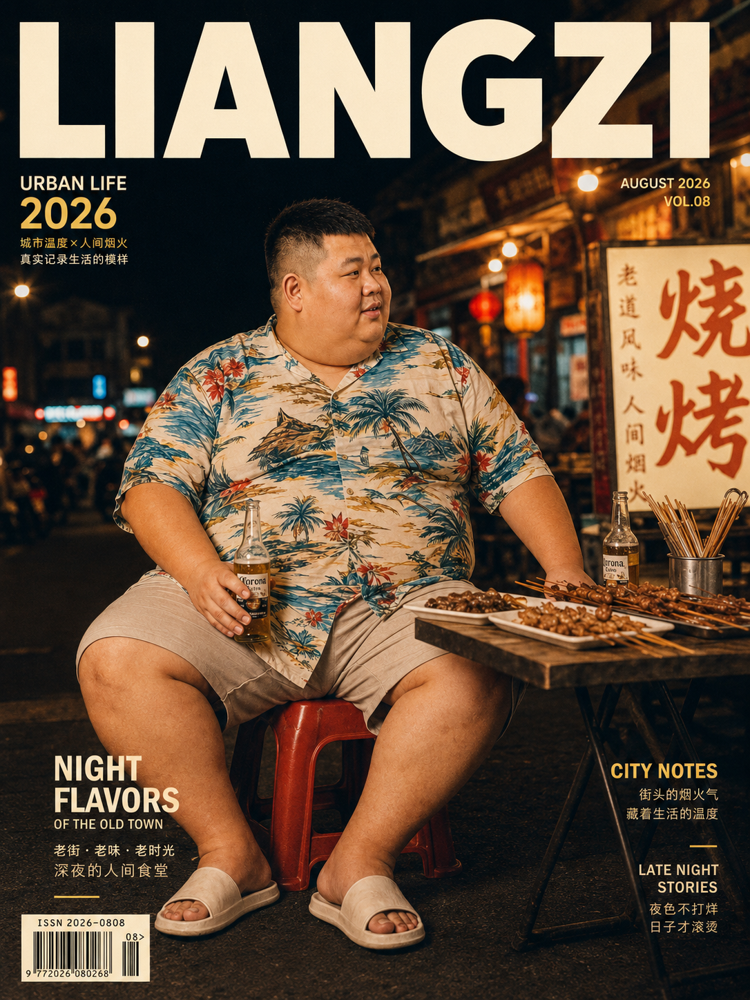
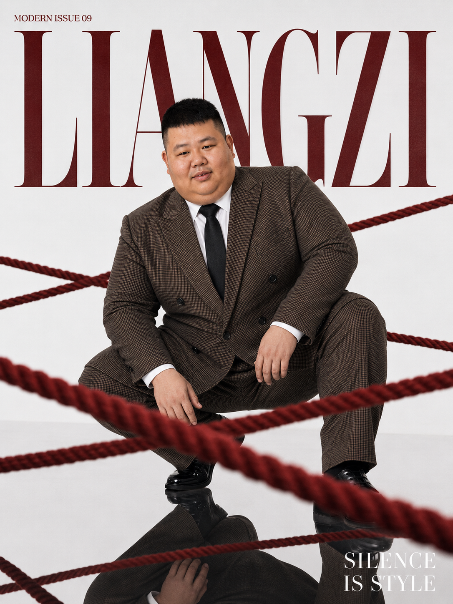

# 良子

## 人物参考图

## 核心提示词

参考提供的良子多视角参考图，完全保留人物外形特征：东亚肥胖男性，身高约175cm，体重150kg+，圆脸有双下巴，黑色短发两侧剃短，体型敦实，面部特征和参考图完全一致。

输出为时尚杂志封面，大尺寸加粗无衬线刊名大字位于画面顶部，搭配对应主题的装饰性文字、小字标语、日期/期数排版在画面边角，整体是专业时尚大片质感，电影级光影，拍摄角度有张力，视觉冲击力强，画质高清细节丰富。

## 不同风格的提示词

### 1. 秋日休闲复古风

穿搭为粉色灯芯绒外套搭配草绿色高领内搭、橘红色长裤，背景是秋季开阔草原，整体暖色调，风格休闲复古，添加“2024 10/27 AUTUMN 秋日限定”类的文字元素。

### 2. 未来都市机能风

穿搭为亮面橙色机能风长款外套，佩戴橙色墨镜，背景是摩天大楼玻璃幕墙的未来都市，低角度仰拍，整体橙蓝撞色，科技感十足，添加“URBAN PULSE 2025 未来城市”类的文字元素。

### 3. 港口硬朗西装风

穿搭为深色正式西装搭配白衬衫黑领带，姿态放松躺在报废的红色敞篷跑车上，背景是港口码头，整体质感硬朗高级，添加“URBAN PULSE 2025 AUTUMN 力量，本就是一种风格”类的文字元素。

### 4. 新中式武侠风

穿搭为暗纹刺绣黑色唐装，外罩半透明红色纱质罩衫，手持一把乌木折扇，背景是雨夜的中式飞檐古建筑，冷调蓝红撞色，雨滴效果，氛围感拉满。文字搭配“东方力 2026 夏季刊 侠者无界”类国风元素字样，整体是新中式武侠美学风格。

### 5. 美式街头亚文化风

穿搭为oversize黑色涂鸦牛仔外套、破洞工装裤，脚踩厚底板鞋，佩戴银色粗链项链，靠在满是涂鸦的街头集装箱旁，背景是霓虹闪烁的复古滑板场，暖黄+冷紫撞色，高饱和色调，街头纪实感。文字搭配“街头共振 VOL.12 大码潮流特辑”类字样，整体是美式街头亚文化风格。

### 6. 海岛轻奢度假风

穿搭为宽松米白色真丝度假衬衫，搭配亚麻短裤，赤足站在白色沙滩上，背景是蓝绿色的海面和日落橙粉色天空，身侧放着冰桶和香槟，柔和暖光，慵懒松弛感拉满。文字搭配“夏日逸乐 2026 海岛特刊 松弛即自由”类字样，整体是高端度假轻奢风格[8]。

### 7. 未来赛博朋克风

穿搭为带LED发光条的黑色赛博机能装甲外套，佩戴半透明发光面罩，背景是下雨的赛博朋克都市街道，全息广告霓虹灯闪烁，低角度仰拍，蓝紫+亮粉撞色，科技感拉满。文字搭配“赛博纪元 2077 城市进化特辑”类字样，整体是未来赛博朋克风格。

### 8. 复古市井纪实风

穿搭为花色夏威夷衬衫+宽松大短裤，坐在老城区宵夜摊的塑料板凳上，面前摆着烤串和冰啤酒，背景是亮着暖黄色灯牌的老街道，复古胶片质感，暖色调，充满生活气息。文字搭配“烟火人间 2026 城市生活特辑”类字样，整体是复古市井纪实风格。

## 自动化试跑记录

### 9. 试跑 - 秋日休闲复古风

使用 ChatGPT 桌面版 + GPT Image 2 生成。参考良子多视角参考图，沿用核心提示词，主题为秋季开阔草原、粉色灯芯绒外套、草绿色高领内搭、橘红色长裤、休闲复古杂志封面。

### 10. 试跑 - 港口硬朗西装风

使用 ChatGPT 桌面版 + GPT Image 2 生成。参考良子多视角参考图，沿用核心提示词，主题为深色正式西装、白衬衫黑领带、报废红色敞篷跑车、港口码头、硬朗高级杂志封面。

### 11. Codex 直出 - 秋日休闲复古风

使用 Codex 内置生图能力直接生成。参考良子多视角参考图，沿用秋日休闲复古主题，用于对比 ChatGPT 桌面版生成路线。人物一致性、服装和场景表现较好；刊名排版过大，右侧有裁切，后续提示词需加入“顶部刊名完整显示、不得出血裁切”约束。

### 12. GPT 临时路线 - SP003 柔暖近景生活感肖像

使用 ChatGPT Plus 浏览器临时 fallback 生成。来源为 `2026-06-05-v1` 第一轮风格包提示词队列 T001，参考良子多视角参考图与 SP003 风格参考图。主题为柔和暖光、近景生活感肖像、暖米色纸感杂志封面，用于验证良子在柔暖近景封面中的人物一致性和亲和力表现。

### 13. GPT 临时路线 - SP004 松弛半身生活场景版式

使用 ChatGPT Plus 浏览器临时 fallback 生成。来源为 `2026-06-05-v1` 第一轮风格包提示词队列 T002，参考良子多视角参考图与 SP004 风格参考图。主题为大码休闲穿搭、生活场景半身构图、柔和暖光和松弛市井感，用于验证良子在生活化场景封面中的稳定性。

### 14. MVP二轮 - 复古市井纪实升级版

使用 ChatGPT Plus 浏览器临时 fallback 生成。来源为第二轮修订队列 T004，参考良子多视角参考图、外部柔暖风格参考和既有复古市井纪实风。主题为老城区宵夜摊、花色夏威夷衬衫、复古胶片夜景和超大 LIANGZI 主视觉，用于验证良子市井生活线的升级效果。

### 15. MVP二轮 - 港口硬朗西装高级版

使用 ChatGPT Plus 浏览器临时 fallback 生成。来源为第二轮修订队列 T005，参考良子多视角参考图、外部档案海报版式和既有港口硬朗西装风。画面质量和人物一致性较好，但主视觉文字漂移为 `URBAN PULSE`，未严格遵循 `LIANGZI`，后续提示词需要进一步压制参考图文字迁移。

### 16. MVP二轮 - 红绳镜面西装 LIANGZI 背景版

使用 ChatGPT Plus 浏览器临时 fallback 生成。来源为第二轮 MVP 临时追加任务 T012，参考良子多视角参考图、外部高定光影参考和嘎子红绳镜面西装封面。主题为纯白镜面、红色粗绳、棕色格纹大码西装和超大 LIANGZI 背景字，用于验证高奢符号化版式向良子的迁移效果。

